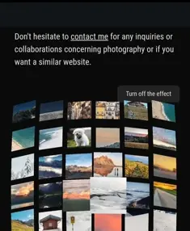

# Photo portfolio app

This is a photo gallery app built with Next.js.
The app supports multiple photo data providers including local file system, Vercel Blob storage, Google Photos, and dummy data.
The photos are rendered as a grid of thumbnails with a modal window for full-size photo.
The grid has a kind of parallax effect when you move the mouse or you incline your mobile device.

You can find a demo here: https://photo.artem.work

Or click on the image to watch the short video of the effect:

[](public/screenshots/photos-example.webm)

## Configuration

You can switch between data providers in the [config file](./src/app.config.ts):

### File System

```ts
dataSource: 'fs';
```

Loads photos from the local `./public/photos` directory. This is the simplest option for getting started.

**Pros:**

- No external dependencies
- Simple setup
- Works offline
- Best for local development

**Cons:**

- Photos are bundled with the app
- Limited scalability for large galleries

### Blob Storage (Vercel Blob)

```ts
dataSource: 'blob';
```

Loads photos from Vercel Blob storage. You must provide a Vercel blob storage token in `.env.development.local`:

```
BLOB_READ_WRITE_TOKEN=<token goes here>
```

**Pros:**

- Cloud-based storage
- Scalable for large galleries
- Fast CDN delivery
- Easy integration with Vercel deployments

**Cons:**

- Requires Vercel account
- May incur storage costs

### Google Photos

```ts
dataSource: 'google-photos';
```

Loads photos from a public Google Photos album. See [Google Photos integration guide](./src/data/google-photos/README.md) for detailed setup instructions.

**Setup:** Provide a public album URL in your fetch call:

```ts
const photos = await fetchPhotos('google-photos', 300, {
    publicAlbumUrl: 'https://photos.google.com/share/your-public-album-url',
});
```

**Important:** When using Google Photos (or any external image provider), you should better disable Vercel's image optimization to avoid processing externally-hosted images:

In `next.config.ts`, set:

```ts
nextConfig.images = {
    unoptimized: true,
    remotePatterns: [
        {
            protocol: 'https',
            hostname: 'lh3.googleusercontent.com',
            pathname: '/**',
        },
    ],
};
```

**Pros:**

- Use existing Google Photos albums
- No additional storage needed
- Automatic backups via Google
- Easy photo management - you can add/remove photos in Google Photos app, that's it

**Cons:**

- Relies on Google Photos HTML structure (may break with updates)
- Requires public album
- Less reliable than official API (if not using API key)
- Cannot access all metadata

### Dummy

```ts
dataSource: 'dummy';
```

Generates placeholder photos with random colors. Perfect for testing and development.


**Use cases:**

- Testing UI without real images
- Development without photo assets
- Demos and prototypes

## How to run

Run the development server:

```bash
npm run dev
```

Open [http://localhost:3000](http://localhost:3000) with your browser to see the result.

## How to build production version

```bash
npm run build
npm run start
```

Open [http://localhost:3000](http://localhost:3000) with your browser to see the result.

## How to deploy

- If you have [Vercel](https://github.com/vercel) account, then you can configure automatic deployment on their servers on every commit.

- You can use [Dockerfile](./Dockerfile) to build the image and run it as a container.

- You can use your own Node.js server to run the build with `npm run start`
